# CGBuilder2

**A visual tool for building Martini coarse-grained (CG) molecule models in the browser.**

CGBuilder lets you load an all-atom molecule (from a file or a SMILES string),
map its atoms into CG beads by clicking, define the bonded topology (bonds,
angles, dihedrals, virtual sites, elastic network), and watch a GROMACS-style
`.itp` file assemble live as you work — then download everything you need to run
a simulation.

<p align="center">
  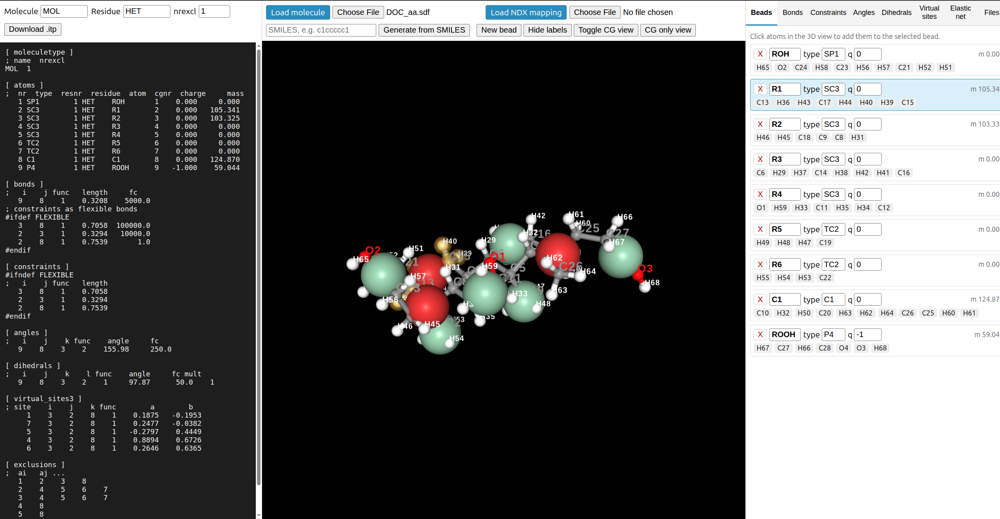
  <br>
  <sub><b>The three-column workspace</b> — the live <code>.itp</code> preview (left) rebuilds on every change, the 3D viewport (center) is where you click atoms into beads, and the tabbed builder (right) holds beads, bonded terms, virtual sites, the elastic network, and file I/O.</sub>
</p>

---

## Features

- **Two ways to load a molecule**
  - Upload a structure file: `.pdb`, `.gro`, `.cif`, `.ent`, `.sdf`, `.mol`, `.mol2` (`.gz` supported).
  - Type/paste a **SMILES** string — a real 3D conformer is generated in-browser (OpenChemLib).
- **Atom→bead mapping** by clicking atoms in the 3D view; per-bead Martini **type**, **charge**, and a settable **residue name**.
- **Automatic bead mass**
  - Each bead's mass is the sum of its atoms' atomic masses.
  - **Unassigned atoms** (e.g. hydrogens you didn't map) have their mass spread onto the bead(s) holding their nearest neighbours *along the bond graph*.
  - **Virtual-site mass** is redistributed to its constructor beads — total mass is always conserved.
- **Bonded terms** — bonds, angles, and dihedrals, each built either:
  - **interactively** — click the beads in the 3D CG view (2 for a bond, 3 for an angle, 4 for a dihedral) and the term is added with its geometry auto-measured, or
  - **by dropdown** — pick beads from menus.
  Force constants, reference values, and multiplicity are editable per entry.
- **Virtual sites** (`virtual_sites3`) — click 3 constructor beads (they turn red), confirm, then click every bead you want built from that triad. Construction parameters `a, b` are solved from the geometry.
- **Elastic network** — add harmonic bonds (GROMACS func 6) between all bead pairs within a cutoff, with a force constant that can decay with distance.
- **Live `.itp` preview** on the left, regenerated on every change.
- **CG-only view** — hide the atoms and show just the labelled beads (name + number), with virtual-site constructors highlighted red.
- **NDX mapping import** — reload a previously exported cgbuilder `.ndx` to restore a bead mapping onto the current structure.
- **Downloads** — CG `.itp`, `.ndx`, `.map`, CG `.gro`, and an all-atom `.gro` reference.

---

## A visual tour

### Three ways to see your molecule

The 3D viewport switches between the all-atom structure, a translucent bead
overlay, and a clean coarse-grained view — with the bonded topology drawn on top.

<table>
<tr>
<td width="33%" align="center">
  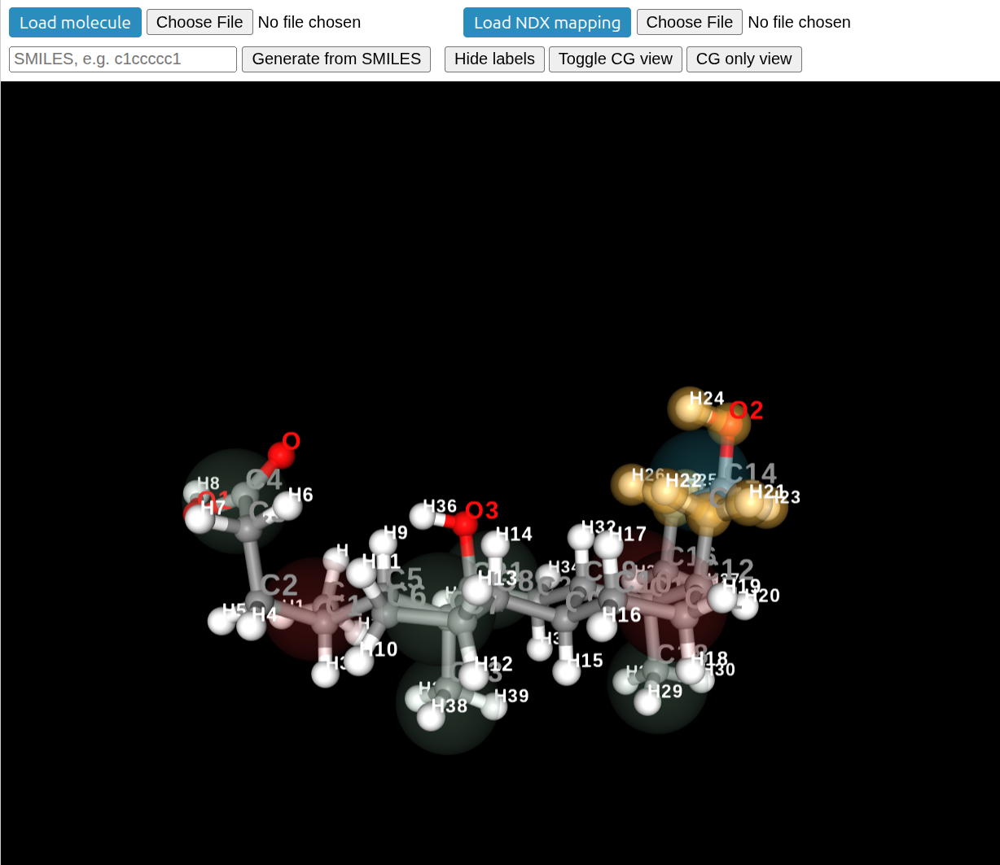<br>
  <sub><b>Map atoms → beads.</b> The all-atom structure with atom-name labels; faint bead spheres mark the current mapping.</sub>
</td>
<td width="33%" align="center">
  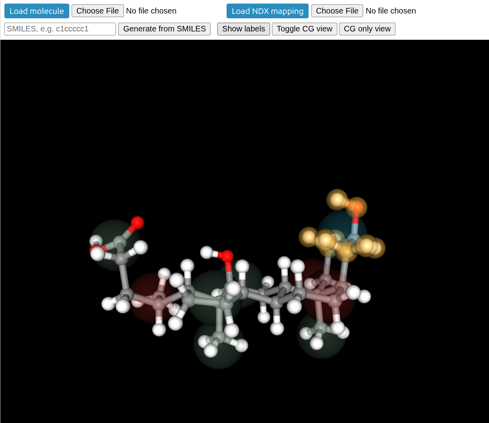<br>
  <sub><b>Toggle CG view.</b> Translucent bead spheres sit over the atoms so you can check coverage at a glance.</sub>
</td>
<td width="33%" align="center">
  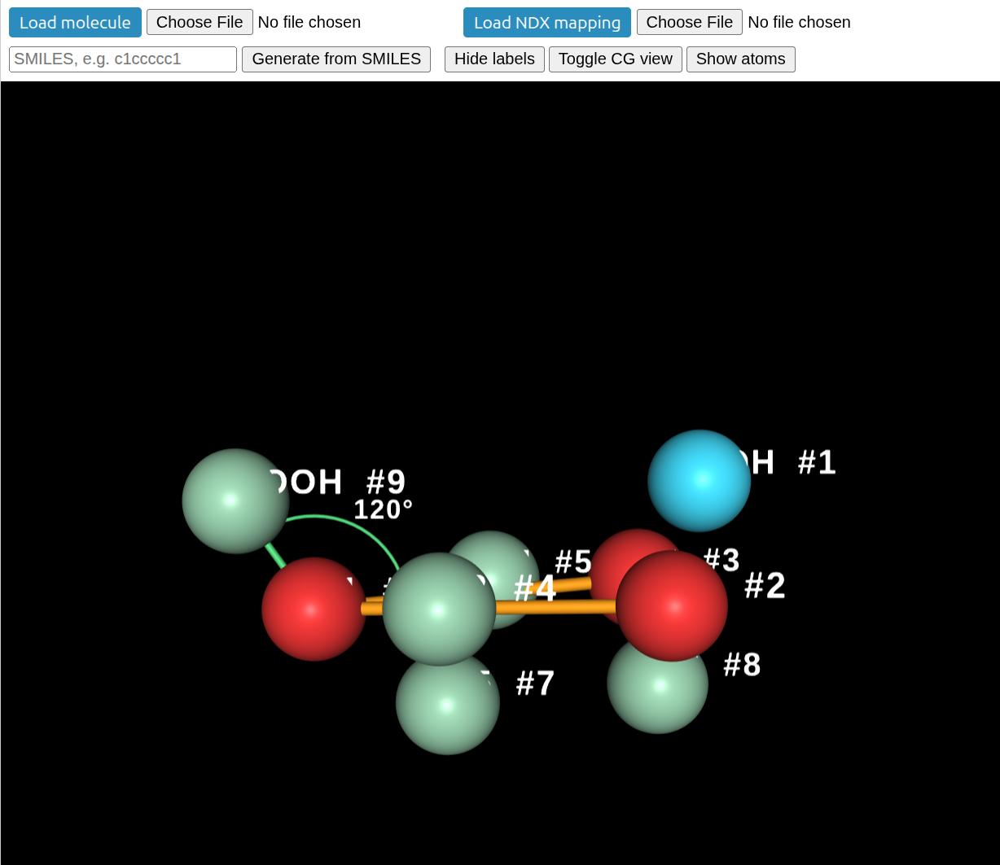<br>
  <sub><b>CG-only view.</b> Just the labelled beads (name + number) with bonds and an angle arc (θ) drawn between centres.</sub>
</td>
</tr>
</table>

### Build every term from the right-hand tabs

Each tab is a self-contained builder: click beads in the 3D view or add terms by
dropdown, then edit force constants and reference values inline.

<table>
<tr>
<td width="25%" align="center">
  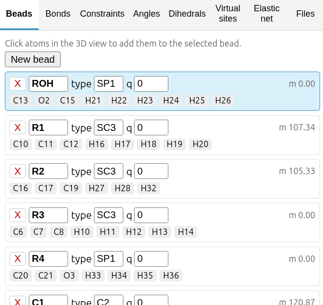<br>
  <sub><b>Beads</b><br>type, charge, live mass</sub>
</td>
<td width="25%" align="center">
  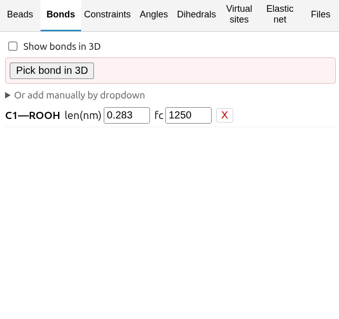<br>
  <sub><b>Bonds</b><br>auto-measured length + fc</sub>
</td>
<td width="25%" align="center">
  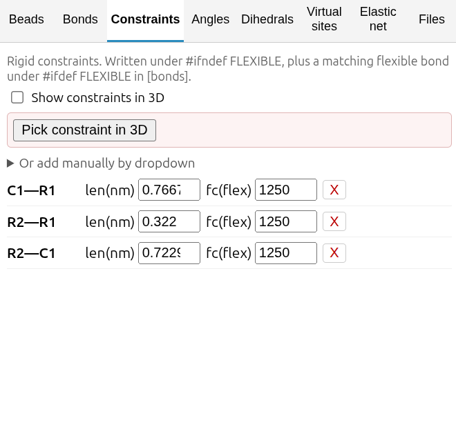<br>
  <sub><b>Constraints</b><br>rigid + <code>#ifdef FLEXIBLE</code></sub>
</td>
<td width="25%" align="center">
  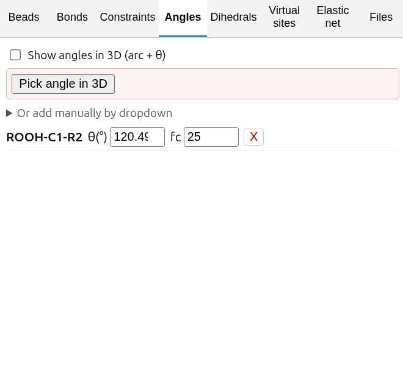<br>
  <sub><b>Angles</b><br>θ + fc</sub>
</td>
</tr>
<tr>
<td width="25%" align="center">
  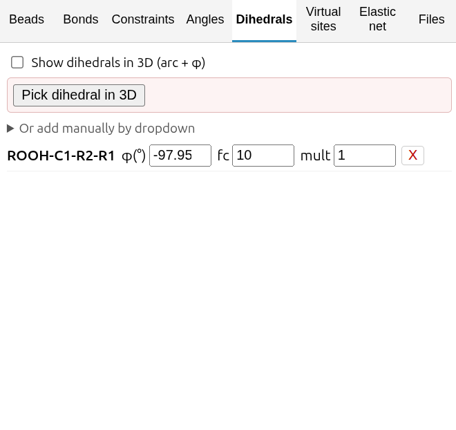<br>
  <sub><b>Dihedrals</b><br>φ + fc + multiplicity</sub>
</td>
<td width="25%" align="center">
  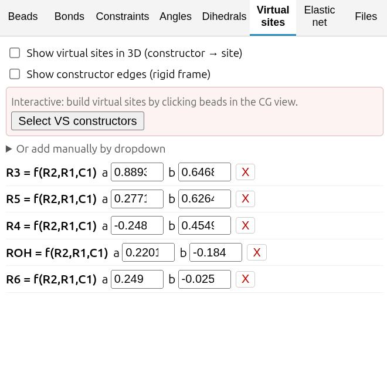<br>
  <sub><b>Virtual sites</b><br>3 constructors → site</sub>
</td>
<td width="25%" align="center">
  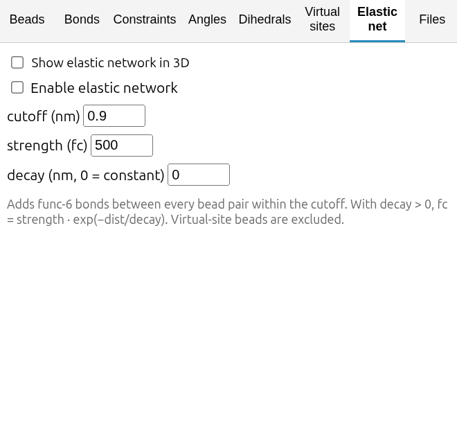<br>
  <sub><b>Elastic net</b><br>cutoff / strength / decay</sub>
</td>
<td width="25%" align="center">
  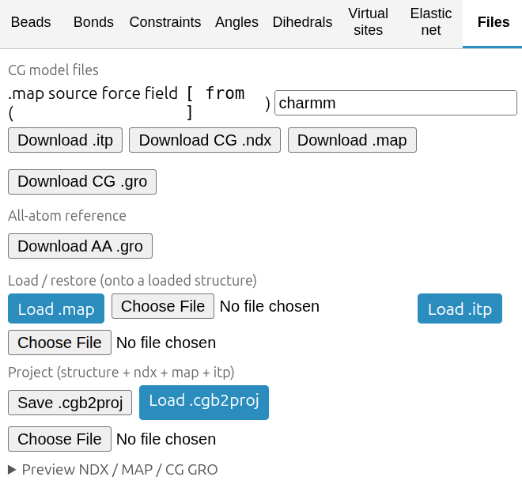<br>
  <sub><b>Files</b><br>download · load · project</sub>
</td>
</tr>
</table>

### Everything downloadable in one place

<p align="center">
  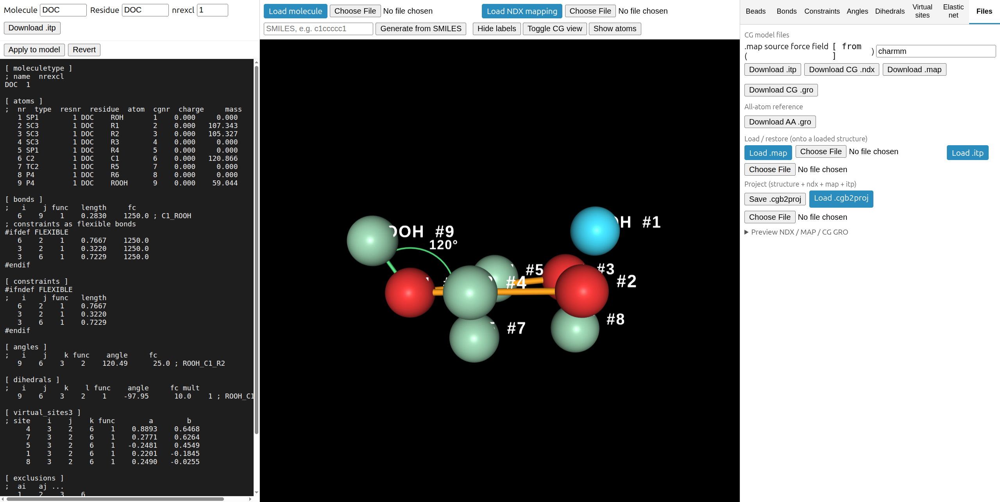
  <br>
  <sub>The <b>Files</b> tab exports the CG <code>.itp</code>, <code>.ndx</code>, <code>.map</code>, CG <code>.gro</code>, and AA <code>.gro</code>, loads a <code>.map</code> or <code>.itp</code> back onto a structure, and saves/restores a full <code>.cgb2proj</code> project. Here bonds and an angle are drawn between bead centres in the CG view.</sub>
</p>

### One file to save, share, and resume — `.cgb2proj`

Building a CG model is rarely done in one sitting, and it's often a team effort.
The **project file** makes that painless: **Save `.cgb2proj`** bundles *everything*
about the session into a single self-contained file —

- the loaded **all-atom structure**,
- the full **bead mapping** (`.ndx`),
- the atom→bead **`.map`**, and
- the complete **topology** (`.itp`): bonds, constraints, angles, dihedrals,
  virtual sites, elastic-network settings, plus the molecule/residue names and nrexcl.

**Load `.cgb2proj`** restores that exact state — the same molecule, beads, terms,
and live `.itp` — so you can pick up precisely where you left off.

- **Stop and restart anytime.** Save at the end of a session, reopen later, keep going. No re-loading a structure or re-mapping atoms.
- **Share with one file.** Send a colleague a single `.cgb2proj` and they open your model as-is — no separate structure, ndx, map, and itp to keep in sync.
- **Nothing to lose track of.** One savefile *is* the project; there's no bundle of loose files whose versions can drift apart.

> Prefer the individual files? They're still there — the same tab exports and
> reloads `.ndx`, `.map`, and `.itp` on their own. The project file is just the
> everything-in-one option.

---

## Getting started

Requires **Node.js 18+** and npm.

```bash
npm install      # install dependencies
npm run dev      # start the Vite dev server (prints a localhost URL)
npm run build    # produce a static bundle in dist/
npm run preview  # serve the built bundle locally
```

Open the printed URL in a browser. The app is fully client-side — no server or
internet connection is required after `npm install`.

## Usage

1. **Load a molecule.** Click **Load molecule** and pick a file, or type a SMILES
   string (e.g. `c1ccccc1`) and press **Generate from SMILES**.
2. **Set the model identity** (left panel): **Molecule** name (`[moleculetype]`),
   **Residue** name (used in `[atoms]` and the GRO; leave blank to keep the
   structure's own residue names), and **nrexcl**.
3. **Map atoms to beads.** In the **Beads** tab, the selected bead is highlighted.
   Click atoms in the 3D view to add/remove them from it. Press **New bead** for
   the next bead. Give each bead a Martini **type** and **charge**; its mass is
   shown live and computed automatically.
4. **Add bonded terms.** On the **Bonds / Angles / Dihedrals** tabs, either press
   **Pick … in 3D** and click the beads in order (the view switches to CG-only so
   beads are clickable), or expand **Or add manually by dropdown**. Edit force
   constants and reference values inline.
5. **Add virtual sites.** On the **Virtual sites** tab, press **Select VS
   constructors**, click 3 beads (they turn red), press **Select as
   constructors**, then click each bead to virtualize. Use **Select new VS
   constructors** to start a fresh triad.
6. **Add an elastic network** (optional) on the **Elastic net** tab: enable it and
   set the cutoff, strength, and decay.
7. **Download** from the left panel (`.itp`) or the **Files** tab (`.itp`, CG
   `.ndx`, `.map`, CG `.gro`, AA `.gro`).

### Tips

- **CG only view** (top controls) hides atoms and labels every bead; VS
  constructors are red. Interactive picking automatically enables it.
- Clicking a bead does nothing outside an active picking mode; switching tabs
  cancels any in-progress pick.
- An atom shared between multiple beads is marked 🔗 in the bead's atom list.

---

## Output files

| File | Contents |
|------|----------|
| `.itp` | Martini topology: `[moleculetype]`, `[atoms]` (type, resnr, residue, charge, **mass**), `[bonds]` (manual + elastic net), `[angles]`, `[dihedrals]`, `[virtual_sites3]`, `[exclusions]`. |
| `.ndx` | GROMACS index groups, one per bead, listing member atom numbers. Re-importable. |
| `.map` | Backward-style mapping file (atom → bead) for the `martini` force field. |
| CG `.gro` | Coarse-grained coordinates (bead centres). |
| AA `.gro` | The loaded all-atom structure, as a reference. |

### Conventions

- **Units:** NGL positions are Ångström; all lengths in the `.itp`/`.gro` are
  converted to nanometres. Angles are in degrees.
- **Function types:** bonds func 1, angles func 2, dihedrals func 1, elastic
  bonds func 6, `virtual_sites3` func 1. All reference values are auto-measured
  from the bead geometry and remain editable.
- **Mass conservation:** unmapped-atom mass follows the bond graph to the nearest
  bead; virtual-site mass is split equally across its three constructors and the
  virtual site itself is written with mass 0.
- **Exclusions:** each virtual site is excluded from its constructors; pairs are
  de-duplicated and grouped by the lower atom index.

---

## Tech stack

- **[NGL](https://nglviewer.org/)** — WebGL molecular visualization and picking.
- **[OpenChemLib](https://github.com/cheminfo/openchemlib-js)** — SMILES parsing
  and 3D conformer generation (pure JS; no server).
- **[Vite](https://vitejs.dev/)** — dev server and bundler.

## Project structure

```
index.html            # 3-column layout: live ITP | 3D viewport | builder tabs
src/
  main.js             # app bootstrap, controller, event wiring
  model/
    bead.js           # Bead + BeadCollection (atom membership, ids)
    topology.js       # bonds / angles / dihedrals / vsites / elastic params
    geometry.js       # distance / angle / dihedral / vsite-param math
    masses.js         # atomic masses, unassigned-atom spread, VS redistribution
  io/
    itp.js            # Martini .itp generator
    legacy.js         # .ndx / .map / CG .gro / AA .gro generators
    ndxImport.js      # parse + apply an .ndx mapping
    loaders.js        # SMILES -> 3D molfile (OpenChemLib)
  ui/
    viz.js            # NGL scene: atom picking, CG spheres, CG-only view
    beadPanel.js      # bead list (name/type/charge/mass)
    bondedPanels.js   # bonds/angles/dihedrals/vsites builders (click + dropdown)
    elasticPanel.js   # elastic-network controls
    itpPanel.js       # live .itp preview
    dom.js            # small DOM helpers
styles/main.css
data/benzene_atb.pdb  # sample molecule
```

---

## Notes & limitations

- SMILES geometry comes from OpenChemLib's conformer generator; for a specific
  experimental conformation, load a structure file instead.
- The GRO box is a placeholder (`10 10 10 nm`) — a builder has no simulation box.
- Multi-residue molecules: set the **Residue** field blank to keep each atom's
  original residue name; a non-blank value overrides all beads with one name.
- Virtual-site mass is split **equally** among constructors (a simple, conserving
  default).

## Citation

If CGBuilder2 is useful in your work, please cite it. As the tool has not been
published in a paper, cite the software directly:

> Schärf, I. (2026). *CGBuilder2: A browser-based tool for building Martini
> coarse-grained models* (Version 2.0.0) [Software]. Institute for Molecular
> Systems Engineering and Advanced Materials, Universität Heidelberg.
> https://github.com/izarscharf/cgbuilder2

BibTeX:

```bibtex
@software{scharf_cgbuilder2_2026,
  author       = {Sch{\"a}rf, Izar},
  title        = {{CGBuilder2}: A browser-based tool for building
                  {Martini} coarse-grained models},
  year         = {2026},
  version      = {2.0.0},
  url          = {https://github.com/izarscharf/cgbuilder2},
  organization = {Institute for Molecular Systems Engineering and
                  Advanced Materials, Universit{\"a}t Heidelberg}
}
```

A machine-readable [`CITATION.cff`](CITATION.cff) is included, so GitHub shows a
**"Cite this repository"** button and tools like Zenodo can read the metadata
directly.

## Attribution

CGBuilder2 is a modernized, extended rewrite of
**[CGBuilder](https://github.com/jbarnoud/cgbuilder)** by **Jonathan Barnoud** and
the CGBuilder contributors, and began as a fork of that project. The original tool
provided the atom→bead mapping workflow and the `.ndx` / `.map` / `.gro` exports;
CGBuilder2 builds on it. The original work is used under the **Apache License 2.0**
(retained in [LICENSE](LICENSE)); see [NOTICE](NOTICE) for the required attribution
and a statement of changes.

## License

CGBuilder2 is released under the **Apache License 2.0** — see [LICENSE](LICENSE)
and [NOTICE](NOTICE).

---

## AI development disclaimer

CGBuilder2 was produced as a **human-guided agentic build**. The author
(Izar Schärf) defined the requirements, steered the design and architectural
decisions, and reviewed, tested, and validated the results, while an AI coding
assistant carried out the implementation across successive iterations. Every
feature was human-directed and human-verified; the AI acted as an implementation
tool under close supervision, not as an autonomous author.
